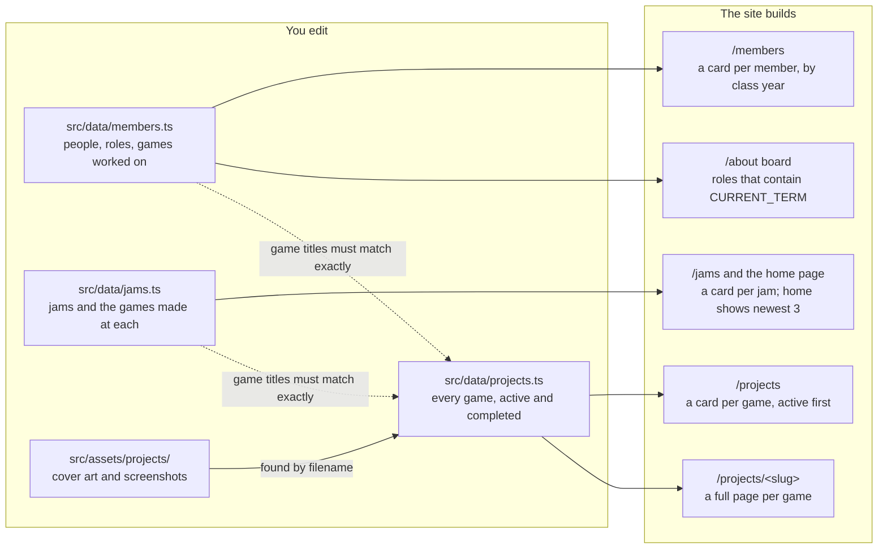

# HGDS Website Wiki

How to edit any part of the Hopkins Game Dev Society website, and where everything lives.

## Contents

1. [Start here](#start-here)
2. [Keeping this wiki in sync](#keeping-this-wiki-in-sync)
3. [Where everything lives](#where-everything-lives)
4. [Games](#games)
5. [Images](#images)
6. [Members and the board](#members-and-the-board)
    - [Game tags must match titles exactly](#game-tags-must-match-titles-exactly)
    - [Changing the board each year](#changing-the-board-each-year)
7. [Game jams](#game-jams)
8. [Page text, layout and styling](#page-text-layout-and-styling)
    - [The shared shell: Layout.astro](#the-shared-shell-layoutastro)
    - [Fonts](#fonts)
    - [Components](#components)
9. [SEO and link previews](#seo-and-link-previews)
    - [Handled automatically](#handled-automatically)
    - [Search-engine data (structured data)](#search-engine-data-structured-data)
    - [Redirects for old links](#redirects-for-old-links)
10. [Running it locally](#running-it-locally)
11. [Publishing](#publishing)
    - [Commit messages](#commit-messages)
12. [Gotchas and troubleshooting](#gotchas-and-troubleshooting)

## Start here

Most edits to the site are edits to one of three data files, not to page code. The site at [www.hopkinsgamedevsociety.com](https://www.hopkinsgamedevsociety.com) is built with [Astro](https://docs.astro.build) from the `hgds-site` GitHub repo, and every push to `main` goes live in about two minutes.

The mental model: **data files describe games, people and jams; page templates turn each entry into cards and pages automatically.** Adding a game means adding an entry to `src/data/projects.ts`, never creating a page file.

| I want to… | Edit this | Section |
| --- | --- | --- |
| Add or update a game | `src/data/projects.ts` | [Games](#games) |
| Add a game's cover art or screenshots | `src/assets/projects/` + the game's entry | [Images](#images) |
| Add a member or change their games | `src/data/members.ts` | [Members and the board](#members-and-the-board) |
| Change who shows as the board on About | officer roles in `members.ts` + `CURRENT_TERM` in `src/pages/about.astro` | [Changing the board each year](#changing-the-board-each-year) |
| Add a game jam | `src/data/jams.ts` | [Game jams](#game-jams) |
| Change a page's wording | that page in `src/pages/` | [Page text, layout and styling](#page-text-layout-and-styling) |
| Change colors, fonts or the header/footer | `src/layouts/Layout.astro` | [The shared shell](#the-shared-shell-layoutastro) |
| Change a page's Google description or share preview | the `<Layout>` tag at the top of that page | [SEO and link previews](#seo-and-link-previews) |
| Keep an old link working | `redirects` in `astro.config.mjs` | [Redirects for old links](#redirects-for-old-links) |
| See my change before it goes live | `npm run deploy:local` | [Running it locally](#running-it-locally) |

You don't need to know Astro to do the common edits. The data files are plain lists of entries; copy an existing entry and change its values.

## Keeping this wiki in sync

This wiki exists in two copies that must always say the same thing: the [HGDS Website Wiki doc](https://claude.ai/code/artifact/3a7b57da-dffb-4ea5-b93e-d9b968ce448e) on Claude, and `docs/WIKI.md` in the repo. Neither copy is the master; whichever one you edit, update the other in the same sitting.

- **Edited the doc?** Make the same change in `docs/WIKI.md` and include it in your next pull request.
- **Changing `docs/WIKI.md` in a pull request?** Make the same change in the doc before the pull request is merged.
- **Changing how the site works** (a new data field, a moved file, a new command or workflow)? Update both copies in the same pull request as the code.
- **Reviewing a pull request?** Don't merge it until both copies match.

The only intended difference is the diagram under [Where everything lives](#where-everything-lives): the doc draws it, and this file uses a Mermaid diagram that GitHub renders. Keep the two diagrams showing the same thing.

## Where everything lives

Everything you edit is under `src/`, plus a few static files in `public/`. Folders not listed here (`dist/`, `node_modules/`, `.astro/`, `tmp/`) are generated or local-only; never edit them.



Edit the boxes on the left and the pages on the right update on the next build. Member and jam game tags only link correctly when their titles match `projects.ts` exactly.

| Path | What it holds | How often you'll touch it |
| --- | --- | --- |
| `src/data/projects.ts` | Every game, active and completed: text, team, links, images | Often |
| `src/data/members.ts` | Every member: class year, roles, games worked on | Often |
| `src/data/jams.ts` | Game jams hosted or joined, and the games made at each | Sometimes |
| `src/assets/projects/` | Game cover art and screenshots (optimized at build time) | Often |
| `src/pages/` | One file per page; the file path is the URL (`about.astro` → `/about`) | Sometimes |
| `src/pages/projects/[slug].astro` | The one template behind every game's detail page | Rarely |
| `src/components/` | Reusable cards: `ProjectCard`, `MemberCard`, `JamCard` | Rarely |
| `src/layouts/Layout.astro` | The shell around every page: `<head>`, header, footer, all global CSS and brand colors | Rarely |
| `src/utils/` | Helpers: game title → page link, title → tag color, image lookup, search-engine data | Rarely |
| `public/` | Files served as-is: logo, `robots.txt`, share image, animated GIFs, `CNAME` | Rarely |
| `astro.config.mjs` | Site URL, old-URL redirects, sitemap, fonts | Rarely |
| `.github/workflows/deploy.yml` | The GitHub Actions job that builds and publishes `main` | Almost never |
| `scripts/` | `local-deploy.sh` / `remote-deploy.sh` preview helpers | Almost never |

## Games

Every game lives in one list in `src/data/projects.ts`, and each entry automatically gets a card on `/projects` and its own page at `/projects/<slug>`. To add a game, copy an existing entry, paste it into the list, and change the values.

```ts
{
  slug: "sunfall",                 // URL: /projects/sunfall
  title: "Sunfall",                // exact title; members.ts and jams.ts must match it
  shortDescription: "Hack and slash through the shadows...",
  status: "archived",              // completed game; leave out while in development
  image: "/images/projects/sunfall-cover.png",
  imageAlt: "Sunfall Cover Art",
  imageOffsetY: 15,
  tagline: "Hack and slash through the shadows...",
  links: [{ label: "Play", url: "https://example.itch.io/sunfall" }],
  about: ["First paragraph.", "Second paragraph."],
  team: [{ name: "Teddy Starynski", roles: ["Team Lead", "Art"] }],
  screenshots: [{ src: "/images/projects/sunfall-shot-1.png", alt: "Concept art" }],
},
```

| Field | Required | Where it shows |
| --- | --- | --- |
| `slug` | Yes | The page URL. Lowercase words joined by hyphens; never change it once live, or old links break. |
| `title` | Yes | Card and page heading. Members and jams link to the game by this exact text. |
| `shortDescription` | Yes (may be `""`) | The blurb on the `/projects` card. |
| `status` | No | `"archived"` = completed. Leave it out for active games; active games sort first on `/projects`. |
| `image` | No | Cover art on the card and the top of the game page, and the link-preview image. See [Images](#images). |
| `imageAlt` | No | Screen-reader text for the cover. Defaults to "&lt;title&gt; cover". |
| `imageOffsetY` | No | Which part of a tall cover shows when it's cropped: 0 = top, 50 = middle (default), 100 = bottom. |
| `tagline` | No | The line under the title on the game page; also its Google description. |
| `links` | No | Gold buttons on the game page (Play, Steam Page, Wiki…). `label` is the button text. |
| `about` | No | The "About the Game" section, one string per paragraph. |
| `team` | No | The credits list. `roles` can be `[]` if unknown. |
| `screenshots` | No | The gallery; clicking one opens it full size. |

Two things happen automatically:

- A game with no `about` paragraphs shows an "under construction" note asking contributors to get in touch on Discord. It disappears once `about` has text.
- The game's Google description, link preview and search-engine data are built from these same fields, so there is nothing separate to update.

To **remove** a game, delete its entry and any references to its title in `members.ts` and `jams.ts`.

## Images

Game art goes in `src/assets/projects/`, but `projects.ts` refers to it as `/images/projects/<filename>`. That mismatch is intentional: the path in the data file is only a lookup key, and the site finds the real file by its filename. At build time each image is converted to WebP and resized for phones and desktops.

To add a game image:

1. Name it `<slug>-cover.png` or `<slug>-shot-1.png`, `-shot-2.png`, and so on. PNG, JPG, WebP and AVIF all work.
2. Make sure it's **no wider or taller than 1920 px**. Anything bigger only makes the repo heavier; visitors never see the extra pixels.
3. Drop it into `src/assets/projects/`.
4. Reference it in the game's entry as `"/images/projects/<slug>-cover.png"` (for `image`) or in `screenshots`. No import or code change is needed.

| Image | Where it goes | Referenced as |
| --- | --- | --- |
| Game cover / screenshot | `src/assets/projects/` | `/images/projects/<file>` in `projects.ts` |
| Animated GIF cover | `public/images/projects/` | `/images/projects/<file>` (same form) |
| Board headshot | `public/images/board/` (create it) | `photo: "/images/board/<file>"` in `members.ts` |
| Club logo, favicon | `public/images/hgds-logo.png` | Used by `Layout.astro` |
| Default link-preview image | `public/images/og-default.png` (1200×630) | Used by `Layout.astro` |

**The GIF exception:** the image optimizer flattens animated GIFs to a single frame, so animated GIFs stay in `public/images/projects/` and are served untouched. `rain-doctor-cover.gif` is the current example. If an image doesn't show up, check that its filename in `projects.ts` matches the file exactly, including the extension.

Images rescued from the old Squarespace site often have a `.png` or `.jpg` name but WebP contents. Convert them to a real PNG before adding them.

## Members and the board

People live in `src/data/members.ts`; the Members page and the About page's board section are both built from it. There is no separate board list to maintain.

```ts
{
  name: "Teddy Starynski",
  classYear: "Class of 2027",       // Members page groups by this exact text
  roles: ["Co-President '26-27", "Developer", "Art"],
  games: ["Red Gold", "Sunfall"],    // must match projects.ts titles exactly
  photo: "/images/board/teddy.jpg",  // optional headshot on the board card
},
```

| Field | Required | Notes |
| --- | --- | --- |
| `name` | Yes | Shown on the member card. |
| `classYear` | Yes | Written as `Class of YYYY`. Members are grouped under it, newest year first. Keep the wording identical, or a member lands in their own group. |
| `roles` | Yes | Shown on the card. An officer role ends with its term, e.g. `"Treasurer '26-27"`; past terms stay as history. |
| `games` | No | Tags on the card that link to each game's page. |
| `photo` | No | Headshot on the About page board card. Put the file in `public/images/board/`. |

### Game tags must match titles exactly

Each entry in `games` must match a game's `title` in `projects.ts` character for character: capitals, punctuation and all (`"ADSOMNIA!"`, not `"Adsomnia"`). A mismatch doesn't break the build; the tag just links to `/projects` instead of the game and gets a different color. Tag colors are picked from the title text, so the same game is the same color everywhere.

### Changing the board each year

The About page shows everyone with a role containing the current term. When a new board takes over:

1. Add the new officer roles in `members.ts` with the new term, e.g. `"Co-President '27-28"`. Leave old roles in place.
2. Change `CURRENT_TERM` near the top of `src/pages/about.astro` to the new term, e.g. `"'27-28"`.
3. If there is a new title, add it to `TITLE_ORDER` in the same file to control its position. Unlisted titles sort to the end.

The term must be written the same way everywhere, including the straight apostrophe: `'27-28`.

## Game jams

Jams live in `src/data/jams.ts`, **newest first**: the whole list shows on `/jams`, and the first three show on the home page. Add a new jam at the top of the list.

```ts
{
  name: "GMTK Game Jam",
  timeframe: "2025",              // or "Jan 24-26, 2025"; leave out if unknown
  role: "participated",           // or "hosted"; leave out for no badge
  location: "Hodson Hall",        // optional
  description: "One-line blurb.", // optional
  link: "https://itch.io/jam/gmtk-jam-2025", // optional
  games: ["Deja You"],            // must match projects.ts titles exactly
},
```

| Field | Required | Shows as |
| --- | --- | --- |
| `name` | Yes | Card heading. |
| `timeframe` | No | Date line on the card. |
| `role` | No | `"hosted"` → a "Hosted by HGDS" badge; `"participated"` → a "Participated" badge. |
| `location` | No | Location line. |
| `description` | No | Short paragraph. |
| `link` | No | Link to the jam's own page (itch.io, Global Game Jam, etc.). |
| `games` | No | Colored tags linking to each game's page. Same exact-title rule as member tags. |

A jam game also needs its own entry in `projects.ts` for its tag to link anywhere. Without one, the tag falls back to `/projects`.

## Page text, layout and styling

Each page's wording is written directly in its file in `src/pages/`; everything shared by all pages is in `src/layouts/Layout.astro`. An `.astro` file has a code section between two `---` lines at the top, then HTML below it. Text edits happen in the HTML part.

| Page | File | What's editable there |
| --- | --- | --- |
| Home `/` | `src/pages/index.astro` | Intro paragraph, Discord and About buttons, recent-jams heading |
| About `/about` | `src/pages/about.astro` | Mission and getting-involved text; `CURRENT_TERM` and `TITLE_ORDER` for the board |
| Members `/members` | `src/pages/members.astro` | Page intro (cards come from `members.ts`) |
| Projects `/projects` | `src/pages/projects/index.astro` | Page intro; `SHOW_STATUS_BADGES` toggles "In Development" badges |
| A game's page | `src/pages/projects/[slug].astro` | Layout shared by every game; content comes from `projects.ts` |
| Jams `/jams` | `src/pages/jams.astro` | Page intro (cards come from `jams.ts`) |
| Not found | `src/pages/404.astro` | Message and buttons |

**A new page** is a new file: `src/pages/events.astro` becomes `/events`. Start by copying `404.astro`, which is the simplest page. Add it to the navigation in `Layout.astro` if it should appear there.

### The shared shell: `Layout.astro`

- **Header and navigation:** the `<header>` near the bottom of the file. Nav links are a plain list of `<a href>` tags.
- **Footer:** the `<footer>` right after it, with the Discord link and club email.
- **Global CSS:** one big `<style is:global>` block. Shared classes include `.card`, `.grid`, `.section`, `.lede` and `.button-link`.
- **Brand colors:** CSS variables at the top of that block. Change a color there and it changes everywhere.

| Variable | Value | Used for |
| --- | --- | --- |
| `--brand-blue` | `#002d72` | Headings, links, primary text accents (JHU Heritage Blue) |
| `--brand-gold` | `#e1bf89` | Buttons, highlights |
| `--brand-blue-light` | `#68ace5` | Hover states |
| `--header-bg` / `--footer-bg` | `#081a3a` | Header and footer background |
| `--bg`, `--panel`, `--text`, `--muted`, `--border` | various | Page background, cards, body text, borders |

### Fonts

Body text is **Inter** and headings are **Ubuntu Mono**. Both are set up in `astro.config.mjs` under `fonts`, downloaded at build time and served from the site itself. In CSS, use `var(--font-body)` and `var(--font-heading)` rather than font names. To add a weight, add it to that font's `weights` list.

### Components

The cards in `src/components/` (`ProjectCard`, `MemberCard`, `JamCard`) each carry their own scoped styles at the bottom of the file. Edit a component to change how every card of that kind looks. The look is a deliberate Hopkins blue-and-gold identity, so keep new styles on the existing color variables.

## SEO and link previews

Each page sets its own Google title, description and share image in the `<Layout>` tag at the top of its HTML; game pages fill theirs in automatically from `projects.ts`. Discord, iMessage and social sites build link previews from the same tags.

```astro
<Layout
  title="Jams | Hopkins Game Dev Society"
  description="Game jams hosted and joined by the Hopkins Game Dev Society..."
>
```

| Setting | Rule of thumb | Default if left out |
| --- | --- | --- |
| `title` | Under 60 characters. Inner pages use `Page \| Hopkins Game Dev Society`; the home page is just the club name. | "Hopkins Game Dev Society" |
| `description` | 150–160 characters, written for a person reading search results. | A general club description |
| `image` | A 1200×630 image path for link previews. | `/images/og-default.png` (logo on blue) |
| `noindex` | Hides a page from search results (used on the 404 page). | Off |
| `jsonLd` | Search-engine data (below). | None |

### Handled automatically

| What | Where it comes from |
| --- | --- |
| Game page description | `tagline`, else `shortDescription`, else the first `about` paragraph, cut to ~160 characters |
| Game page share image | A 1200 px JPEG generated from the cover art |
| Sitemap (`/sitemap-index.xml`) | Generated from every page at build time; redirect stubs and the 404 page are left out |
| `robots.txt` | `public/robots.txt`, which points crawlers at the sitemap |
| Canonical links | Built from the page URL and the site address in `astro.config.mjs` |

### Search-engine data (structured data)

`src/utils/structuredData.ts` builds invisible JSON-LD blocks that tell Google what each page is: the club as an `Organization` on Home and About, the site name on Home, and a `VideoGame` on each game page built from its `projects.ts` entry. Update the club's email or social links (`sameAs`) in that file. After changes, test a page at [Google's Rich Results Test](https://search.google.com/test/rich-results).

### Redirects for old links

The old Squarespace site put games at root-level URLs like `/vesuvius`. `redirects` in `astro.config.mjs` sends those to `/projects/vesuvius`. If you ever rename a game's `slug`, add a redirect from the old URL so existing links keep working:

```js
const redirects = {
  '/vesuvius': '/projects/vesuvius',
  '/projects/old-slug': '/projects/new-slug',
};
```

GitHub Pages can't do server-side redirects, so these are instant client-side redirect pages. Google treats them as redirects.

## Running it locally

You need [Node.js](https://nodejs.org) 22.12 or newer and access to the [Hopkins-Game-Dev-Society/hgds-site](https://github.com/Hopkins-Game-Dev-Society/hgds-site) repo. First-time setup:

```sh
git clone git@github.com:Hopkins-Game-Dev-Society/hgds-site.git
cd hgds-site
npm install
npm run dev
```

Then open http://localhost:4321. The dev server reloads the page as you save, which is the fastest way to work on text, data and styles.

| Command | What it does | Use it when |
| --- | --- | --- |
| `npm run dev` | Live-reloading dev server at `localhost:4321` | Editing anything |
| `npm run deploy:local [port]` | Builds your working copy exactly as production would, then serves it (default port 8080) | Final check before you push |
| `npm run deploy:remote [port]` | Builds whatever is on GitHub `main` in a temporary folder and serves it (default 8081); your local edits aren't included | Seeing what's live without your changes |
| `npm run astro -- check` | Type-checks every `.astro` and `.ts` file | After editing data files, to catch typos |
| `npm run build` | Builds the static site into `dist/` | Rarely by hand; the deploy scripts run it for you |

Check your change with `deploy:local` before pushing, not just `dev`. The production build is what optimizes images, generates the sitemap and downloads the fonts, and it fails loudly on mistakes the dev server might tolerate.

Don't run `npm run build` while a `deploy:local` or `deploy:remote` server is running. Those servers read straight from `dist/`, and a rebuild under them crashes them. Re-running the deploy script is safe: it rebuilds first, then restarts the server.

## Publishing

A push to `main` is a publish: GitHub Actions builds the site and puts it live at www.hopkinsgamedevsociety.com within about two minutes, with no review step in between. Treat every push to `main` as going straight to the public, which is why changes reach it only through pull requests.

1. Make your change and check it with `npm run deploy:local`.
2. Commit with a prefixed message (below).
3. Push your branch and open a pull request, then check with the site maintainer (currently Brady Bock). Nobody pushes to `main` directly; the maintainer reviews and merges every pull request.
4. Once your pull request is merged into `main`, watch the deploy run in the repo's **Actions** tab.
5. When the run turns green, reload the live site to confirm.

If the build fails, nothing is published and the live site stays on the last good version. Open the failed run in the Actions tab; the error is usually a typo in a data file, which `npm run astro -- check` would have caught locally.

The workflow lives in `.github/workflows/deploy.yml`. It can also be run by hand from the Actions tab ("Run workflow") to republish without a new commit. The custom domain comes from `public/CNAME`; don't delete that file.

### Commit messages

Start every commit message with one of these prefixes:

| Prefix | For | Example |
| --- | --- | --- |
| `[Feat]` | Something new: a page, a feature, a new game | `[Feat] Add Evershore project page` |
| `[Fix]` | Something broken that now works | `[Fix] Correct Hijax team credits` |
| `[Tweak]` | Small adjustments to existing content or styling | `[Tweak] Tighten card spacing on mobile` |
| `[Chore]` | Maintenance with no visible change: dependencies, config, cleanup | `[Chore] Update Astro to 6.1` |

## Gotchas and troubleshooting

Most problems on this site fail silently: the build passes and the page looks slightly wrong. Start here when something doesn't show up the way you expected.

| Symptom | Likely cause | Fix |
| --- | --- | --- |
| A game tag links to `/projects` instead of the game | The title in `members.ts` or `jams.ts` doesn't exactly match `projects.ts` | Copy the title from `projects.ts` character for character |
| The same game shows in two different tag colors | Same cause: two spellings of one title | Same fix |
| A cover or screenshot is missing | Filename in `projects.ts` doesn't match the file in `src/assets/projects/` (check the extension) | Rename one to match |
| An animated GIF only shows its first frame | The GIF is in `src/assets/projects/`, where it gets flattened | Move it to `public/images/projects/` |
| A member shows up in their own year group | `classYear` worded differently (`"Class of 2027"` vs `"2027"`) | Use `Class of YYYY` exactly |
| An officer is missing from the About page | Their role's term doesn't contain `CURRENT_TERM` exactly (often a curly apostrophe ’ instead of ') | Retype the term with a straight apostrophe |
| The build fails after a data edit | A missing comma, quote or bracket in the data file | Run `npm run astro -- check`; it names the file and line |
| A Discord link preview still shows old text | Discord caches previews for a while | Wait, or add `?v=2` to the link when testing |
| The local preview server crashed | `npm run build` was run while it was serving `dist/` | Re-run `npm run deploy:local` |
| The `*.github.io/hgds-site/` address looks unstyled | Expected: the site is built for the custom domain, not that sub-path | Use the real domain or `deploy:local` |

**Mac only:** the shell scripts in `scripts/` start with `#!/bin/bash` on purpose. Some Macs have an old Intel-only bash elsewhere on the PATH that breaks the build, so don't change the first line to `#!/usr/bin/env bash`.
